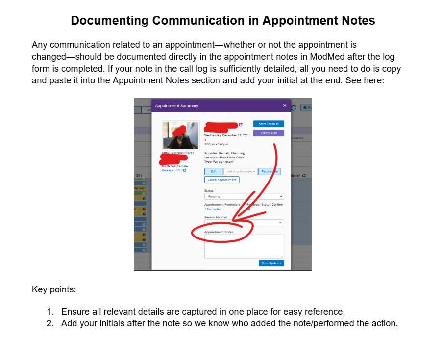
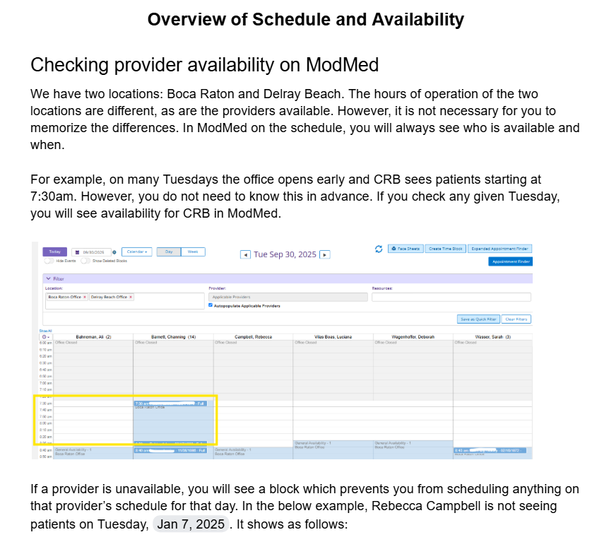

# Documenting Communication in Appointment Notes

Any communication related to an appointment—whether or not the appointment is changed—should be documented directly in the appointment notes in ModMed after the log form is completed. If your note in the call log is sufficiently detailed, all you need to do is copy and paste it into the Appointment Notes section and add your initial at the end. See here:

## Key points:

1. Ensure all relevant details are captured in one place for easy reference.
2. Add your initials after the note so we know who added the note/performed the action.

---

# Overview of Schedule and Availability

## Checking provider availability on ModMed

We have two locations: Boca Raton and Delray Beach. The hours of operation of the two locations are different, as are the providers available. However, it is not necessary for you to memorize the differences. In ModMed on the schedule, you will always see who is available and when.

For example, on many Tuesdays the office opens early and CRB sees patients starting at 7:30am. However, you do not need to know this in advance. If you check any given Tuesday, you will see availability for CRB in ModMed.

If a provider is unavailable, you will see a block which prevents you from scheduling anything on that provider's schedule for that day. In the below example, Rebecca Campbell is not seeing patients on Tuesday, Jan 7, 2025. It shows as follows: